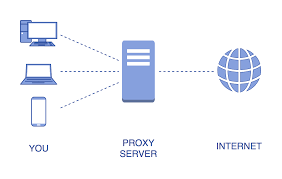
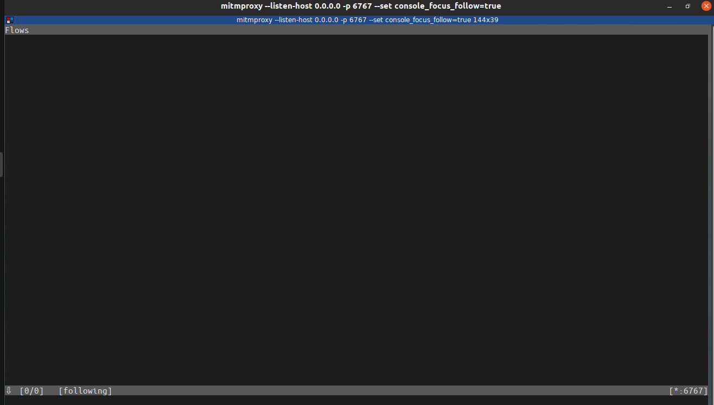
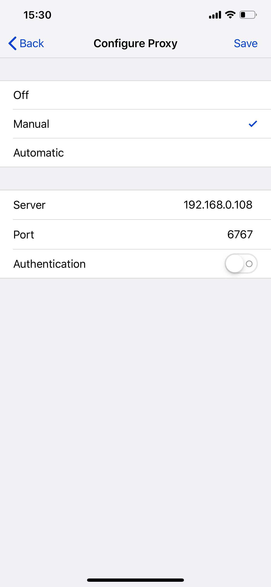
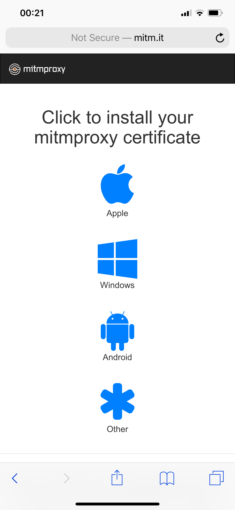
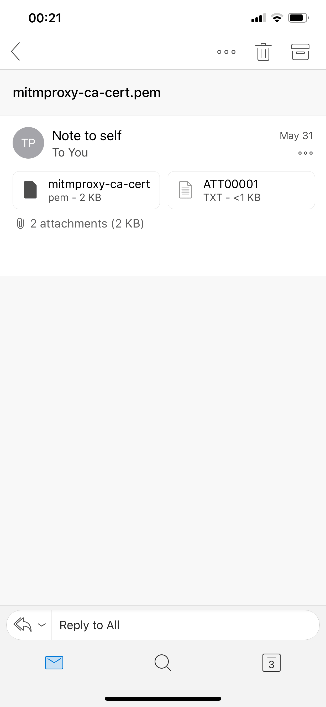
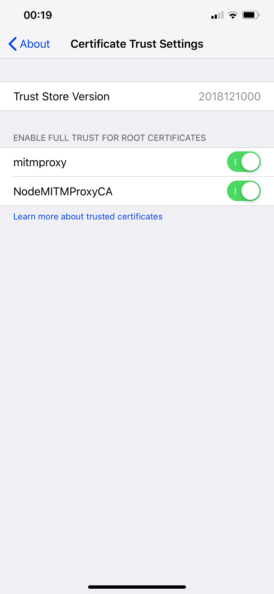
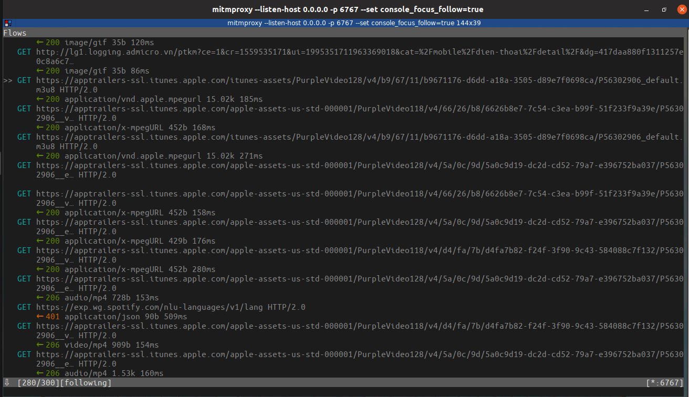

During my development cycles in Coc Coc Search Engine, I initially overwhelmed with the fact that so many of my colleagues use proxy to debug and simulate production environment. We stated to use proxy mainly to avoid CORS conflicts with various 3rd party APIs and due to company security policies. Of course we had few Proxies snippet using [node-http-mitm-proxy](https://github.com/joeferner/node-http-mitm-proxy) but it was quite... hard for a newcomer to understand or set all these up right. With my curiousity, I digged into the core project which it was ported to Nodejs package - mitmproxy.

First thing first, here is the simplify model of a proxy server:

::: tip
Basically to its core, a proxy server serves it purpose to be a middleman between clients and destination servers. It can intercept/modify HTTP/HTTPS packets traveling between two/many points.
:::
## FAQ
#### ___1. Why do we need a middleman here?  ___
#### ___2. Why don't just connect right away?___
## Answers:

The simple answer is so it can modify/listen/forward packets when traveling from clients to servers.  For example, your router can be considered as proxy server for your clients to connect to upper-level networks, such as to another routers/hub/servers or at the end is your ISP (Internet Service Providers).

 In the past we had [Fiddler](https://www.telerik.com/fiddler) by Telerik. Here we have [mitmproxy](https://mitmproxy.org/) to establish a proxy server to intercept HTTP/HTTPS packets. Nevertherless, it must only be done with good intentions.

## Prerequisites:

__Install mitm via pip3, the easiest way:__

`embed:install.bash`

## Let's dig in:
::: tip
In this guide, client machine runs on iOS 12.1.3
:::

### __1. Start mimtmproxy server:__
`embed:commandmitm.bash`

mitmproxy displays console, where packets will be shown.

### __2. Configure proxy on client machine:__

#### __2.1. Configure proxy in settings:__

The reason we should set proxy server host on `0.0.0.0` because all IPv4 addresses on the local machine will able to find your proxy server address.
We have to determine your proxy server IP address either by entering:

`embed:ip.bash`

`embed:resultip.bash`

or just goes to your network setting and see the your local machine address for yourself.

__You add the address of the proxy server in the Wifi settings.__

In this example, my proxy server local IPv4 address is `192.168.0.108` with port `6767`

Go to [mitm.it](http://mitm.it), if you see a download list of certificates then you have successfully connected to your proxy server.

#### 2.2. Install mitmproxy SSL:
In order to allow mitmproxy to intercept connection(s) from our client machine, we have to install a custom mitmproxy SSL. Everytime our client(s) make a request, mitmproxy generates a valid certificate to the destination host. I recommend saving the downloaded certificates somewhere but you have to open it my Safari. In this example, I emailed myself the mitmproxy certificate - just for future use.

Next, go to __Settings - General - About - Certificate Trust Settings__ and enable mitmproxy certificates.

Well done, we have configured successfully our connection on client machine(s) with proxy server. Let's test by going into any applications/websites. Here I went to AppStore.

#### 2.3 Let's see how our proxy server captures requests:

Voila! :stars: You can see __every HTTPS request__ from my iPhone to AppStore has been captured by mitmproxy. From this point of view, we can see/modify methods/headers/responses of requests. Furthermore, we can save these requests and produce client replays.

Coming up in next series, I will guide you how to intercept/modify traffics by using mitmproxy and Python scripts. Happy coding/hacking!

