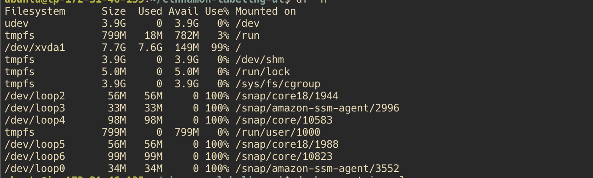
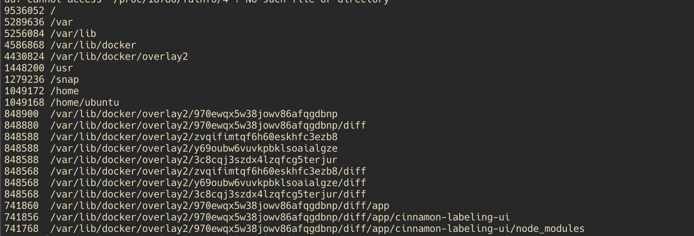
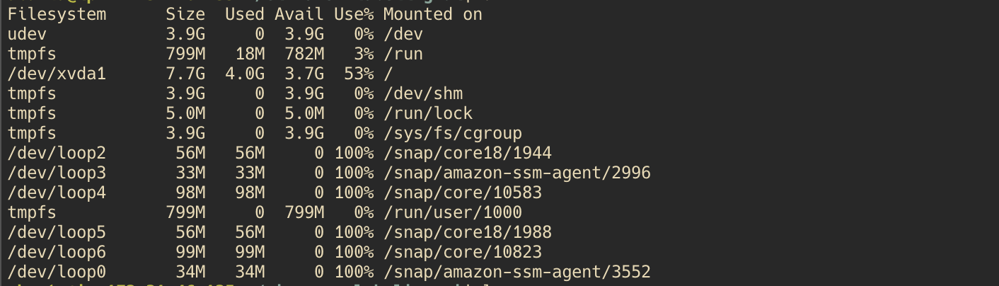

import { Kbd, Code, Alert, AlertIcon  } from '@chakra-ui/react';

On the other day, when I did `ssh` into my AWS EC2 instance

I was pressing <Kbd>Tab</Kbd>  to perform auto-complete my command. For example:
```bash
cd dir/...
```

The following error happens: 

<Alert status="error" mb={3} fontWeight={700}>
        <AlertIcon/> bin/bash... You cannot create temp file for here-document: No space left on device
</Alert>


I was using Vim as my favourite text editor. No matter how hard did I try, the error still happened and disallow me either creating new files or saving any contents.

Quickly I checked my disk storage using: 
```bash
df -h
```



There you are: `/dev/xvda1` is full `99%`, normally this is the main mount partition where most of the user's data are located.

Let's sort out top 20 files with heaviest sizes and purge them:

``` bash
cd $HOME
sudo du -a / | sort -n -r | head -n 20
```



As you can see, my most heaviest files are residing at `docker/overlay`. Obviously, sometimes we need to clear some dangling networks/volumes/caches.

I was using the experimental `DOCKER_BUILDKIT` and rebuild some of my images with `--no-cache` command. 
Apparently, fowarding `ssh-agent` and cloning repositories with `--mount=type=ssh` are cached permanantly unless we use `--no-cache` manually.
Thus, bloat up the disk storage.

```bash
docker system prune -a
```
You will be greeted with a warning, I was not worry much because this is my `proof of concept` EC2 instance.
``` bash
WARNING! This will remove:
        - all stopped containers
        - all networks not used by at least one container
        - all dangling images
        - all build cache
Are you sure you want to continue? [y/N] y
```

The end result:



My `/dev/xvda1` was freed, I returned the available spaces to my instances. Mission success!


